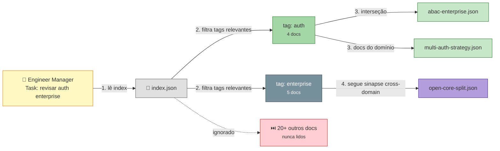

# KB Neural Network — Mindmap

## 1. Estrutura do KB (como os arquivos se organizam)

```mermaid
mindmap
  root((**.claude/kb/**))
    schema.json
      doc types
        identity
        decision
        pattern
        fact
        feedback
        reference
      lifecycle rules
        permanent
        learning
        state
      required fields
        per type
    index.json
      by_tag
        auth → 5 docs
        enterprise → 8 docs
        realtime → 3 docs
        fuselage → 5 docs
        omnichannel → 4 docs
      by_domain
        eng-core → 4 docs
        eng-auth → 4 docs
        eng-frontend → 3 docs
        design → 3 docs
        product → 3 docs
        marketing → 2 docs
      by_type
        decisions
        patterns
        bugs
        facts
      by_lifecycle
        permanent
        learning
        state
      stats
        total docs
        total tags
        stale count
        last rebuilt
    docs/
      abac-enterprise.json
      meteor3-migration.json
      fuselage-over-mui.json
      ddp-over-ws.json
      open-core-split.json
      mongodb-replica.json
      design-system-own.json
      livechat-widget-cors.json
      community-driven-growth.json
      "... (flat, sem hierarquia)"
    scripts/
      build-index.sh
      validate.sh
      check-stale.sh
      extract-tags.sh
```

## 2. Rede Neural — Como os docs se conectam via tags (Rocket.Chat simulado)

```mermaid
graph TB
    %% === DOCS (neurônios) ===
    ABAC["abac-enterprise<br/><small>decision · eng-auth</small>"]
    MULTI["multi-auth-strategy<br/><small>decision · eng-auth</small>"]
    E2E["e2e-encryption-keys<br/><small>decision · eng-auth</small>"]
    OAUTH["custom-oauth-provider<br/><small>pattern · eng-auth</small>"]

    METEOR["meteor3-migration<br/><small>decision · eng-core</small>"]
    MONGO["mongodb-replica<br/><small>decision · eng-core</small>"]
    DDP["ddp-over-ws<br/><small>decision · eng-core</small>"]
    OPLOG["oplog-race-condition<br/><small>bug · eng-core</small>"]

    FUSE_DEC["fuselage-over-mui<br/><small>decision · eng-frontend</small>"]
    UIKIT["uikit-abstraction<br/><small>decision · eng-frontend</small>"]
    PERF["sidebar-rerender-perf<br/><small>bug · eng-frontend</small>"]

    MOLEC["moleculer-as-transport<br/><small>decision · eng-enterprise</small>"]
    DDPS["ddp-streamer-separate<br/><small>decision · eng-enterprise</small>"]
    MATRIX["matrix-federation<br/><small>decision · eng-enterprise</small>"]

    QUEUE["queue-worker-service<br/><small>decision · eng-omnichannel</small>"]
    TRANSC["transcript-pdf-gen<br/><small>decision · eng-omnichannel</small>"]

    SANDBOX["apps-engine-sandbox<br/><small>decision · eng-platform</small>"]
    MARKET_D["marketplace-model<br/><small>decision · eng-platform</small>"]

    WEBRTC["webrtc-signaling<br/><small>decision · eng-media</small>"]

    DS_OWN["design-system-own<br/><small>decision · design</small>"]
    SPACING["spacing-scale<br/><small>pattern · design</small>"]
    COLORS["color-tokens<br/><small>pattern · design</small>"]

    OPENCORE["open-core-split<br/><small>decision · product</small>"]
    OMNI_PIL["omnichannel-as-pillar<br/><small>decision · product</small>"]
    MARKET_P["marketplace-platform-play<br/><small>decision · product</small>"]

    COMMUNITY["community-driven-growth<br/><small>decision · marketing</small>"]

    %% === TAGS (sinapses) ===

    %% tag: auth
    ABAC ---|"auth"| MULTI
    MULTI ---|"auth"| E2E
    E2E ---|"auth"| OAUTH
    ABAC ---|"auth"| OAUTH

    %% tag: enterprise
    ABAC ---|"enterprise"| OPENCORE
    OPENCORE ---|"enterprise"| MOLEC
    MOLEC ---|"enterprise"| DDPS
    DDPS ---|"enterprise"| QUEUE
    QUEUE ---|"enterprise"| TRANSC

    %% tag: realtime
    DDP ---|"realtime"| OPLOG
    DDP ---|"realtime"| WEBRTC
    DDP ---|"realtime"| DDPS

    %% tag: fuselage / design-system
    FUSE_DEC ---|"fuselage"| DS_OWN
    DS_OWN ---|"fuselage"| SPACING
    SPACING ---|"fuselage"| COLORS
    FUSE_DEC ---|"design-system"| COLORS

    %% tag: marketplace
    UIKIT ---|"marketplace"| MARKET_D
    MARKET_D ---|"marketplace"| MARKET_P
    MARKET_D ---|"marketplace"| SANDBOX

    %% tag: omnichannel
    QUEUE ---|"omnichannel"| OMNI_PIL
    TRANSC ---|"omnichannel"| OMNI_PIL

    %% tag: mongodb
    MONGO ---|"mongodb"| OPLOG
    MONGO ---|"mongodb"| METEOR

    %% tag: microservices
    MOLEC ---|"microservices"| DDPS
    MOLEC ---|"microservices"| QUEUE

    %% tag: security
    E2E ---|"security"| SANDBOX
    ABAC ---|"security"| E2E

    %% tag: open-source / community
    OPENCORE ---|"open-source"| COMMUNITY
    COMMUNITY ---|"open-source"| MATRIX

    %% tag: meteor
    METEOR ---|"meteor"| DDP

    %% tag: react
    FUSE_DEC ---|"react"| PERF

    %% === ESTILOS ===

    %% eng-auth = verde
    style ABAC fill:#A5D6A7,stroke:#2E7D32
    style MULTI fill:#A5D6A7,stroke:#2E7D32
    style E2E fill:#A5D6A7,stroke:#2E7D32
    style OAUTH fill:#A5D6A7,stroke:#2E7D32

    %% eng-core = verde escuro
    style METEOR fill:#66BB6A,stroke:#1B5E20,color:#fff
    style MONGO fill:#66BB6A,stroke:#1B5E20,color:#fff
    style DDP fill:#66BB6A,stroke:#1B5E20,color:#fff
    style OPLOG fill:#66BB6A,stroke:#1B5E20,color:#fff

    %% eng-frontend = azul
    style FUSE_DEC fill:#90CAF9,stroke:#1565C0
    style UIKIT fill:#90CAF9,stroke:#1565C0
    style PERF fill:#90CAF9,stroke:#1565C0

    %% eng-enterprise = cinza escuro
    style MOLEC fill:#78909C,stroke:#37474F,color:#fff
    style DDPS fill:#78909C,stroke:#37474F,color:#fff
    style MATRIX fill:#78909C,stroke:#37474F,color:#fff

    %% eng-omnichannel = teal
    style QUEUE fill:#80CBC4,stroke:#00695C
    style TRANSC fill:#80CBC4,stroke:#00695C

    %% eng-platform = amarelo
    style SANDBOX fill:#FFF59D,stroke:#F57F17
    style MARKET_D fill:#FFF59D,stroke:#F57F17

    %% eng-media = rosa
    style WEBRTC fill:#F48FB1,stroke:#C2185B

    %% design = roxo claro
    style DS_OWN fill:#CE93D8,stroke:#6A1B9A
    style SPACING fill:#CE93D8,stroke:#6A1B9A
    style COLORS fill:#CE93D8,stroke:#6A1B9A

    %% product = roxo
    style OPENCORE fill:#B39DDB,stroke:#4527A0
    style OMNI_PIL fill:#B39DDB,stroke:#4527A0
    style MARKET_P fill:#B39DDB,stroke:#4527A0

    %% marketing = laranja
    style COMMUNITY fill:#FFCC80,stroke:#E65100
```



## 3. Navegação do Agent na Rede



## Legenda

| Cor | Domínio |
|---|---|
| 🟢 Verde claro | eng-auth |
| 🟢 Verde escuro | eng-core |
| 🔵 Azul | eng-frontend |
| ⬛ Cinza | eng-enterprise |
| 🟢 Teal | eng-omnichannel |
| 🟡 Amarelo | eng-platform |
| 🔴 Rosa | eng-media |
| 🟣 Roxo claro | design |
| 🟣 Roxo | product |
| 🟠 Laranja | marketing |
| — Linhas entre docs | Tags compartilhadas (sinapses) |
