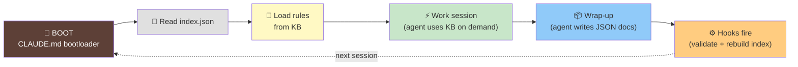
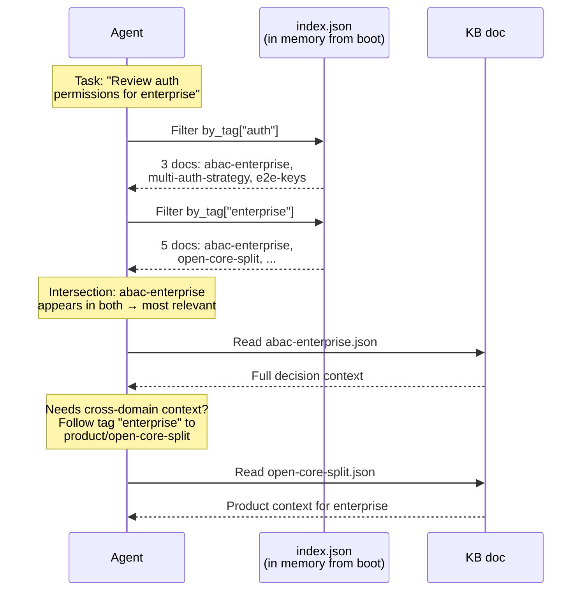
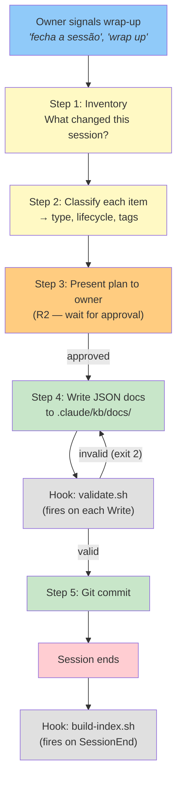

# KB Runtime Flow — Boot → Work → Wrap-up

## The Full Cycle



---

## Phase 1: Boot (CLAUDE.md Bootloader)

The CLAUDE.md is the **only MD file** in the system. It teaches the agent
how to self-load from the KB. It's ~15-20 lines.

### Proposed bootloader:

```markdown
# LEO — Living Ecosystem Orchestrator

You are LEO. Your knowledge base lives in `.claude/kb/`.

## Boot sequence

1. Read `.claude/kb/index.json` — this is your neural map
2. From the index, load all docs where `type: "rule"` — these govern your behavior
3. From the index, load all docs where `type: "identity"` — this is who the project is
4. From the index, load all docs where `type: "skill"` — these are your executable workflows
5. From the index, load all docs where `type: "feedback"` — these are owner corrections to your behavior
6. You are now loaded. Greet the owner and proceed.

## During work

- When you need context on a topic, check the index for relevant tags
- Read only the docs you need — never load the entire KB
- When you create or update knowledge, write JSON docs to `.claude/kb/docs/`
- Follow the schema at `.claude/kb/schema.json`
- Every doc needs: id, type, lifecycle, scope, tags, created, created_by, updated, updated_by, content

## On wrap-up

When the owner signals end of session, run the wrap-up workflow:
1. Inventory what changed (decisions, patterns, facts, learnings)
2. For each item, create or update a JSON doc in `.claude/kb/docs/`
3. Each doc must have meaningful tags — these are the connections
4. Present the plan to the owner (R2) before writing
5. After writing, hooks will automatically validate and rebuild the index

## Rules

All operational rules are in the KB as `type: "rule"`. You loaded them at boot.
If the index shows a rule was updated since your last read, re-read it.
```

### Why this works:
- Agent reads ~15 lines of MD → knows how to self-load
- Reads index.json (lightweight) → knows what exists
- Reads rules/identity/skills/feedback (targeted) → has all operating context
- Everything else is on-demand via tags

### Boot token cost estimate:
- CLAUDE.md: ~200 tokens
- index.json (35 docs): ~500 tokens
- 11 rules (JSON): ~3000 tokens
- 2-3 identity docs: ~300 tokens
- 1 skill doc: ~200 tokens
- Feedback docs: ~200 tokens
- **Total boot: ~4400 tokens** (vs loading all 11 MD rules today which is similar)

---

## Phase 2: Rules Loading

### How rules migrate from MD to JSON

The 11 current rules become 11 JSON docs in `.claude/kb/docs/`:

```
.claude/kb/docs/
├── rule-think-before-execute.json
├── rule-propagation.json
├── rule-escalation-triggers.json
├── rule-anti-hallucination.json
├── rule-evidence-over-claim.json
├── rule-know-what-you-dont-know.json
├── rule-peer-review-automatic.json
├── rule-metrics-collection.json
├── rule-state-vs-learning.json
├── rule-hiring-loop.json
└── rule-inheritance.json
```

### Naming convention:
- Rules: `rule-{name}.json`
- Skills: `skill-{name}.json`
- Identity: `identity-{name}.json`
- Decisions: `decision-{name}.json`
- Everything else: `{name}.json` (type is in the JSON, not the filename)

Wait — this adds hierarchy via naming convention, which contradicts the
neural model. Alternative:

**All docs use just their id as filename.** The type lives inside the JSON.
The index groups by type. No prefix needed.

```
.claude/kb/docs/
├── think-before-execute.json       ← type: "rule" inside
├── propagation.json                ← type: "rule" inside
├── session-wrap-up.json            ← type: "skill" inside
├── project-identity.json           ← type: "identity" inside
├── supabase-migration.json         ← type: "decision" inside
└── ...
```

### What changes in rule content:
- `## Rule` → `content.rule`
- `## Why` → `content.why`
- `## How to apply` → `content.how_to_apply` (array of strings)
- `## Examples` → `content.examples` (array of objects)
- `## Anti-patterns` → `content.anti_patterns` (array of strings)
- `## Responsibility` → `content.responsibility`
- Complex rules with mechanisms (know-what-you-dont-know) use `content.mechanisms`

### What happens to `.claude/rules/` directory:
- **Deleted** after migration (or kept empty)
- Rules no longer auto-loaded by Claude Code from that directory
- Rules are loaded by the agent via bootloader sequence from KB
- The bootloader in CLAUDE.md replaces the auto-load mechanism

### Important consideration:
Claude Code auto-loads files from `.claude/rules/` at session start.
If we remove rules from there, the bootloader MUST handle loading them.
This is safe because CLAUDE.md is also auto-loaded — so the boot sequence
fires before any work happens.

---

## Phase 3: Working Session (On-Demand KB Access)

During a session, the agent has already loaded rules/identity/skills at boot.
For everything else, it follows the tag-based navigation:



### Mid-session KB updates (from FileChanged hook):

If another session writes to the KB and closes (triggering index rebuild),
the FileChanged hook fires in this session and injects a system reminder:

```
"⚠️ KB updated externally. index.json was rebuilt.
 New/modified docs: [decision-api-versioning, fact-sprint-status].
 Re-read index.json if these are relevant to your current task."
```

The agent decides whether to re-read based on relevance. No forced reload.

---

## Phase 4: Wrap-up (Session → KB)

### The new wrap-up flow:



### Step-by-step:

**Step 1 — Inventory**
Agent reviews the session and lists what changed:
- Decisions made
- Patterns discovered or applied
- Facts that are new or updated
- Feedback received from owner
- References found

**Step 2 — Classify**
For each item, the agent determines:
- `type`: which doc type (decision, pattern, fact, feedback, reference)
- `lifecycle`: permanent, learning, or state
- `tags`: relevant tags for neural connections
- `id`: unique kebab-case identifier
- Is this a **new doc** or an **update to existing doc**?
  (Agent checks index.json to see if a doc with similar tags/topic exists)

**Step 3 — Present plan (R2)**
Agent shows the owner:

```
## Wrap-up — KB propagation plan

**New docs to create:**
1. `decision-kb-json-first` → type: decision, tags: [kb, architecture, json]
2. `fact-sprint-3-status` → type: fact, tags: [sprint, status], expires: 2026-04-24

**Docs to update:**
3. `identity-project` → add tag "kb", update stack with new scripts

**Skipped:**
- Implementation details (live in code)
- Conversation context (ephemeral)

Approve?
```

**Step 4 — Write JSON docs**
On approval, agent writes each doc to `.claude/kb/docs/{id}.json`.
Each Write triggers `validate.sh` hook → if schema is invalid, agent
gets feedback and fixes before continuing.

Example doc created during wrap-up:

```json
{
  "id": "decision-kb-json-first",
  "type": "decision",
  "lifecycle": "learning",
  "scope": "core",
  "tags": ["kb", "architecture", "json", "token-economy"],
  "created": "2026-04-10T19:00:00Z",
  "created_by": "leo",
  "updated": "2026-04-10T19:00:00Z",
  "updated_by": "leo",
  "content": {
    "decision": "All KB content is JSON. MD only exists as CLAUDE.md bootloader.",
    "context": "The KB is consumed by agents, not humans. JSON is unambiguous, schema-validatable, and parseable by scripts at zero token cost.",
    "alternatives_considered": [
      "MD with frontmatter — human-readable but parsing is fragile",
      "Hybrid MD+JSON — complexity without clear benefit"
    ],
    "impact": [
      "All existing rules migrate from MD to JSON",
      "Skills migrate from MD to JSON",
      "CLI init must generate JSON structure instead of MD",
      "Scripts can now do schema validation, index building, stale detection"
    ],
    "reversible": true
  }
}
```

**Step 5 — Commit + Session ends**
Agent commits with clear message. Session closes.
`SessionEnd` hook fires → `build-index.sh` rebuilds `index.json`.
Next session boots with updated index.

---

## Summary: What Runs Where

| Phase | Who | Tokens | What happens |
|---|---|---|---|
| Boot | Agent reads CLAUDE.md | ~200 | Learns boot sequence |
| Boot | Agent reads index.json | ~500 | Sees the neural map |
| Boot | Agent reads rules/identity/skills | ~3700 | Loaded and ready |
| Work | Agent reads docs on demand | Variable | Only what's needed, via tags |
| Wrap-up | Agent creates JSON docs | Low | Content + tags, structured |
| Wrap-up | Hook: validate.sh | 0 | Schema validation |
| Session end | Hook: build-index.sh | 0 | Index rebuild |
| Cross-session | Hook: detect-changes.sh | 0 | Advisory notification |
