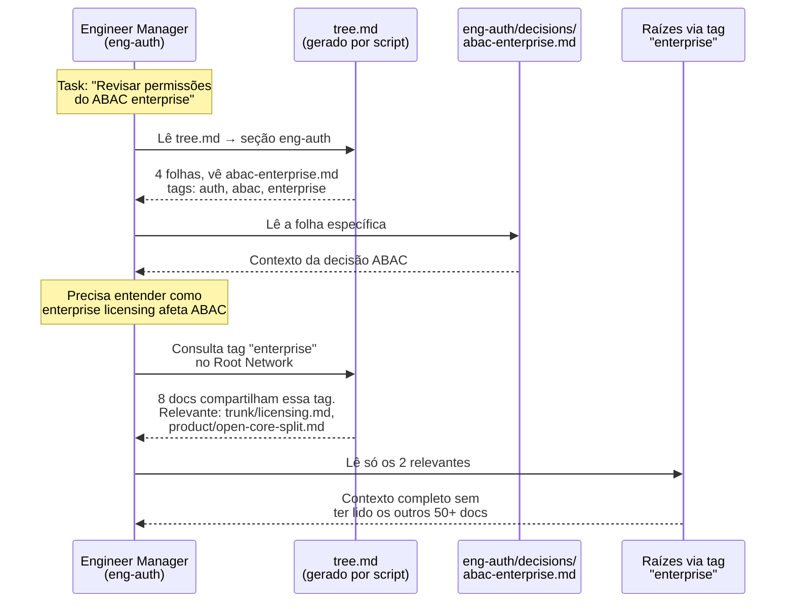

# Tree Model — Simulação: Rocket.Chat

> Como ficaria a Knowledge Base estruturada em árvore
> aplicada a um projeto real com ~57 packages, ~90 módulos,
> 6 microservices enterprise, e múltiplos domínios de produto.

## Estrutura de Diretórios

```
.claude/
├── tree.md                          ← 🗺️ INDEX gerado por script (mapa da árvore)
│
├── trunk/                           ← 🪵 TRONCO (identidade — muda raramente)
│   ├── project.md                   #tags: [rocketchat, open-source, messaging]
│   ├── brand.md                     #tags: [rocketchat, brand, identity]
│   ├── stack.md                     #tags: [meteor, mongodb, react, typescript, moleculer, nats]
│   ├── architecture.md              #tags: [monorepo, monolith, microservices, hybrid]
│   └── licensing.md                 #tags: [open-core, enterprise, mit]
│
├── branches/                        ← 🌿 GALHOS (domínios — cada um é um time)
│   │
│   ├── eng-core/                    ← Eng: plataforma core (Meteor, DDP, MongoDB)
│   │   ├── _branch.md               #tags: [meteor, ddp, mongodb, realtime]
│   │   ├── decisions/
│   │   │   ├── meteor3-migration.md          #tags: [meteor, migration, breaking-change]
│   │   │   ├── mongodb-replica-mandatory.md  #tags: [mongodb, infra, oplog]
│   │   │   └── ddp-over-ws.md                #tags: [ddp, websocket, realtime]
│   │   ├── patterns/
│   │   │   ├── feature-module-pattern.md     #tags: [meteor, modules, architecture]
│   │   │   └── model-typings-layer.md        #tags: [mongodb, typescript, models]
│   │   └── bugs/
│   │       └── oplog-race-condition.md       #tags: [mongodb, oplog, realtime, bug]
│   │
│   ├── eng-frontend/                ← Eng: React + Fuselage + UIKit
│   │   ├── _branch.md               #tags: [react, fuselage, uikit, typescript]
│   │   ├── decisions/
│   │   │   ├── fuselage-over-mui.md          #tags: [fuselage, design-system, react]
│   │   │   ├── uikit-abstraction.md          #tags: [uikit, marketplace, apps-engine]
│   │   │   └── storybook-for-qa.md           #tags: [storybook, testing, fuselage]
│   │   ├── patterns/
│   │   │   ├── hooks-context-provider.md     #tags: [react, hooks, state]
│   │   │   └── fuselage-token-usage.md       #tags: [fuselage, design-system, tokens]
│   │   └── bugs/
│   │       └── sidebar-rerender-perf.md      #tags: [react, performance, sidebar]
│   │
│   ├── eng-omnichannel/             ← Eng: livechat, agents, queues
│   │   ├── _branch.md               #tags: [omnichannel, livechat, agents, routing]
│   │   ├── decisions/
│   │   │   ├── queue-worker-service.md       #tags: [omnichannel, microservices, queue, enterprise]
│   │   │   └── transcript-pdf-gen.md         #tags: [omnichannel, pdf, enterprise]
│   │   ├── patterns/
│   │   │   └── agent-routing-algorithm.md    #tags: [omnichannel, routing, agents]
│   │   └── bugs/
│   │       └── livechat-widget-cors.md       #tags: [livechat, cors, widget, bug]
│   │
│   ├── eng-auth/                    ← Eng: SAML, LDAP, OAuth, 2FA, E2E
│   │   ├── _branch.md               #tags: [auth, security, saml, ldap, oauth, e2e]
│   │   ├── decisions/
│   │   │   ├── multi-auth-strategy.md        #tags: [auth, saml, ldap, oauth, strategy]
│   │   │   ├── abac-enterprise.md            #tags: [auth, abac, enterprise, permissions]
│   │   │   └── e2e-encryption-keys.md        #tags: [e2e, encryption, security]
│   │   └── patterns/
│   │       └── custom-oauth-provider.md      #tags: [auth, oauth, integration]
│   │
│   ├── eng-enterprise/              ← Eng: microservices, scaling, federation
│   │   ├── _branch.md               #tags: [enterprise, microservices, moleculer, nats, scaling]
│   │   ├── decisions/
│   │   │   ├── moleculer-as-transport.md     #tags: [microservices, moleculer, nats, architecture]
│   │   │   ├── ddp-streamer-separate.md      #tags: [ddp, microservices, scaling, websocket]
│   │   │   └── matrix-federation.md          #tags: [federation, matrix, enterprise]
│   │   └── patterns/
│   │       └── ee-directory-separation.md    #tags: [enterprise, licensing, monorepo]
│   │
│   ├── eng-platform/                ← Eng: Apps Engine, Marketplace
│   │   ├── _branch.md               #tags: [apps-engine, marketplace, integrations, platform]
│   │   ├── decisions/
│   │   │   ├── apps-engine-sandbox.md        #tags: [apps-engine, security, sandbox]
│   │   │   └── marketplace-model.md          #tags: [marketplace, apps-engine, strategy]
│   │   └── patterns/
│   │       └── app-lifecycle-hooks.md        #tags: [apps-engine, hooks, api]
│   │
│   ├── eng-infra/                   ← Eng: Docker, CI/CD, Traefik, NATS
│   │   ├── _branch.md               #tags: [docker, ci-cd, traefik, nats, infra]
│   │   ├── decisions/
│   │   │   ├── docker-alpine-multiarch.md    #tags: [docker, alpine, arm64, infra]
│   │   │   ├── turborepo-monorepo.md         #tags: [turborepo, monorepo, build, yarn]
│   │   │   └── traefik-proxy.md              #tags: [traefik, infra, load-balancer]
│   │   └── patterns/
│   │       └── github-actions-matrix.md      #tags: [ci-cd, github-actions, testing]
│   │
│   ├── eng-media/                   ← Eng: video conferencing, VoIP, WebRTC
│   │   ├── _branch.md               #tags: [video, voip, webrtc, media]
│   │   ├── decisions/
│   │   │   └── webrtc-signaling.md           #tags: [webrtc, video, media, realtime]
│   │   └── patterns/
│   │       └── media-calls-enterprise.md     #tags: [video, enterprise, media]
│   │
│   ├── design/                      ← Design: Fuselage, product design
│   │   ├── _branch.md               #tags: [design, fuselage, design-system, ui]
│   │   ├── decisions/
│   │   │   ├── design-system-own.md          #tags: [fuselage, design-system, strategy]
│   │   │   ├── accessibility-react-aria.md   #tags: [accessibility, react-aria, fuselage]
│   │   │   └── livechat-widget-theme.md      #tags: [livechat, design, widget, theme]
│   │   └── patterns/
│   │       ├── spacing-scale.md              #tags: [fuselage, spacing, tokens, design-system]
│   │       └── color-tokens.md               #tags: [fuselage, color, tokens, design-system]
│   │
│   ├── product/                     ← Product: PRDs, roadmap, features
│   │   ├── _branch.md               #tags: [product, roadmap, features]
│   │   ├── decisions/
│   │   │   ├── open-core-split.md            #tags: [enterprise, licensing, open-core, strategy]
│   │   │   ├── omnichannel-as-pillar.md      #tags: [omnichannel, product, strategy]
│   │   │   └── marketplace-platform-play.md  #tags: [marketplace, apps-engine, platform, strategy]
│   │   └── patterns/
│   │       └── feature-flag-rollout.md       #tags: [feature-flags, rollout, product]
│   │
│   └── marketing/                   ← Marketing: community, enterprise sales
│       ├── _branch.md               #tags: [marketing, community, open-source, enterprise]
│       ├── decisions/
│       │   ├── community-driven-growth.md    #tags: [community, open-source, marketing, strategy]
│       │   └── enterprise-sales-motion.md    #tags: [enterprise, sales, marketing]
│       └── patterns/
│           └── hacktoberfest-playbook.md     #tags: [community, hacktoberfest, contributors]
│
└── scripts/                         ← 🔧 SCRIPTS (zero tokens)
    ├── build-tree.sh                ← Varre frontmatters → gera tree.md
    ├── check-stale.sh               ← Detecta folhas sem atualização > N dias
    ├── validate-tags.sh             ← Garante que toda folha tem tags
    └── extract-keywords.sh          ← Extrai keywords do conteúdo (opcional)
```

## Exemplo: tree.md gerado pelo script

O script `build-tree.sh` lê todos os frontmatters e gera automaticamente:

```markdown
# 🌳 Rocket.Chat — Knowledge Tree
> Auto-generated. Do not edit manually.
> Last built: 2026-04-10T14:30:00Z

## Trunk
| File | Tags |
|---|---|
| trunk/project.md | rocketchat, open-source, messaging |
| trunk/stack.md | meteor, mongodb, react, typescript, moleculer, nats |
| trunk/architecture.md | monorepo, monolith, microservices, hybrid |
| trunk/licensing.md | open-core, enterprise, mit |

## Branches → Leaves

### eng-core (4 leaves)
| Leaf | Type | Tags |
|---|---|---|
| decisions/meteor3-migration.md | decision | meteor, migration, breaking-change |
| decisions/mongodb-replica-mandatory.md | decision | mongodb, infra, oplog |
| decisions/ddp-over-ws.md | decision | ddp, websocket, realtime |
| bugs/oplog-race-condition.md | bug | mongodb, oplog, realtime, bug |

### eng-auth (4 leaves)
| Leaf | Type | Tags |
|---|---|---|
| decisions/multi-auth-strategy.md | decision | auth, saml, ldap, oauth, strategy |
| decisions/abac-enterprise.md | decision | auth, abac, enterprise, permissions |
| decisions/e2e-encryption-keys.md | decision | e2e, encryption, security |
| patterns/custom-oauth-provider.md | pattern | auth, oauth, integration |

... (demais branches)

## 🌿 Root Network (cross-branch connections)

### Tag: enterprise (8 connections)
- trunk/licensing.md
- eng-omnichannel/decisions/queue-worker-service.md
- eng-omnichannel/decisions/transcript-pdf-gen.md
- eng-auth/decisions/abac-enterprise.md
- eng-enterprise/decisions/moleculer-as-transport.md
- eng-enterprise/decisions/ddp-streamer-separate.md
- eng-media/patterns/media-calls-enterprise.md
- product/decisions/open-core-split.md

### Tag: auth (5 connections)
- eng-auth/decisions/multi-auth-strategy.md
- eng-auth/decisions/abac-enterprise.md
- eng-auth/decisions/e2e-encryption-keys.md
- eng-auth/patterns/custom-oauth-provider.md
- eng-enterprise/decisions/matrix-federation.md

### Tag: fuselage (5 connections)
- eng-frontend/decisions/fuselage-over-mui.md
- eng-frontend/patterns/fuselage-token-usage.md
- design/decisions/design-system-own.md
- design/patterns/spacing-scale.md
- design/patterns/color-tokens.md

### Tag: omnichannel (4 connections)
- eng-omnichannel/decisions/queue-worker-service.md
- eng-omnichannel/decisions/transcript-pdf-gen.md
- eng-omnichannel/patterns/agent-routing-algorithm.md
- product/decisions/omnichannel-as-pillar.md

### Tag: marketplace (3 connections)
- eng-platform/decisions/marketplace-model.md
- eng-frontend/decisions/uikit-abstraction.md
- product/decisions/marketplace-platform-play.md

### Tag: realtime (3 connections)
- eng-core/decisions/ddp-over-ws.md
- eng-core/bugs/oplog-race-condition.md
- eng-media/decisions/webrtc-signaling.md

... (demais tags com 2+ conexões)
```

## Exemplo: frontmatter de uma folha

```yaml
---
name: Migração para Meteor 3
type: decision
status: active
branch: eng-core
tags: [meteor, migration, breaking-change]
created: 2026-03-15
updated: 2026-04-02
---

## Decisão
Migrar de Meteor 2.x para Meteor 3.4 para suporte a async/await nativo
e Node.js 22.

## Contexto
Meteor 2.x usa fibers (deprecated no Node 16+). Sem migração, ficamos
presos no Node 14.

## Impacto
- ~90 feature modules precisam adaptar APIs síncronas → async
- Packages internos que usam `Meteor.wrapAsync` quebram
- DDP client precisa de refactor

## Conceitos relacionados
- Ver também: trunk/stack.md (stack core)
- Ver também: eng-enterprise/decisions/ddp-streamer-separate.md (scaling DDP)
```

## Navegação: como um Agent usaria isso



## Números desta simulação

| Métrica | Valor |
|---|---|
| Branches (galhos) | 11 |
| Leaves (folhas) | ~35 |
| Tags únicas | ~45 |
| Cross-connections (raízes) | ~60 |
| Arquivos que o Agent lê por task | 3-5 (index + branch + folhas relevantes) |
| Arquivos totais no KB | ~45 |
| Custo de manutenção do index | Zero tokens (script) |
