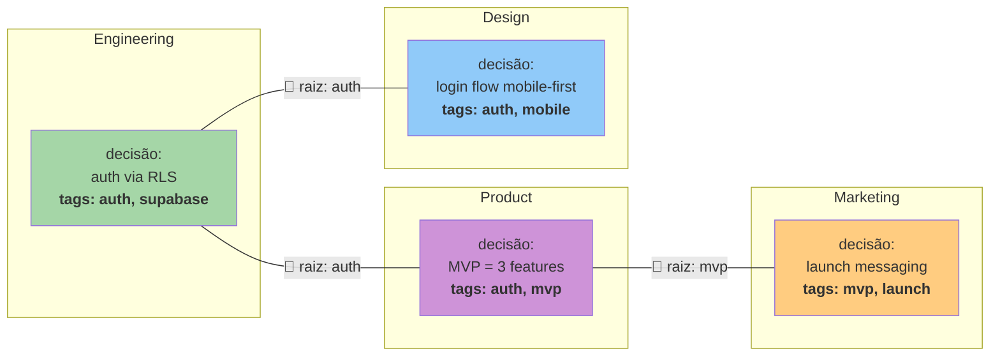
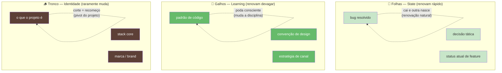
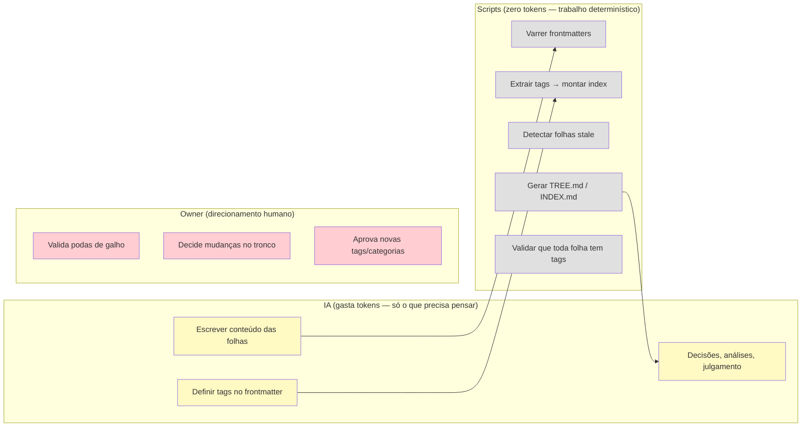
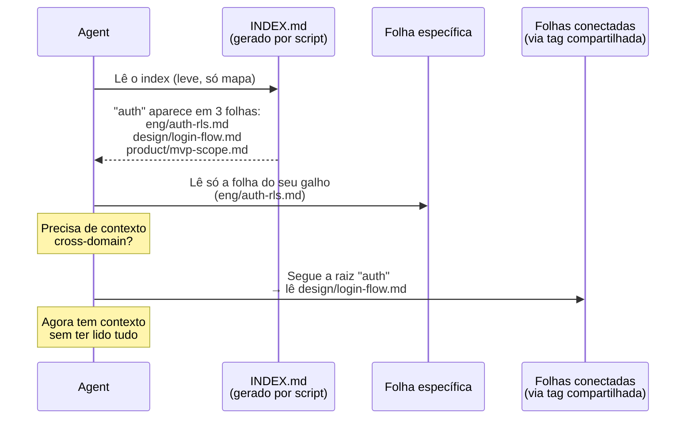

# Tree Model — Knowledge Architecture

## 1. A Árvore (Visão Geral)

```mermaid
graph TD
    TRUNK["🌳 TRONCO<br/>Identidade do Projeto<br/><i>project.md, brand.md, stack.md</i>"]

    TRUNK --> ENG["galho<br/>Engineering"]
    TRUNK --> DESIGN["galho<br/>Design"]
    TRUNK --> MARKETING["galho<br/>Marketing"]
    TRUNK --> PRODUCT["galho<br/>Product"]

    ENG --> E_DEC["🍃 decisão<br/>migrar p/ Supabase"]
    ENG --> E_DEC2["🍃 decisão<br/>auth via RLS"]
    ENG --> E_BUG["🍃 bug resolvido<br/>JWT sem typ header"]
    ENG --> E_PAT["🍃 padrão<br/>edge functions pattern"]

    DESIGN --> D_DEC["🍃 decisão<br/>design system tokens"]
    DESIGN --> D_DEC2["🍃 decisão<br/>mobile-first"]
    DESIGN --> D_PAT["🍃 padrão<br/>spacing rhythm 4-8-16"]

    MARKETING --> M_DEC["🍃 decisão<br/>tom de voz casual"]
    MARKETING --> M_DEC2["🍃 decisão<br/>canal principal: Instagram"]
    MARKETING --> M_PAT["🍃 padrão<br/>post template"]

    PRODUCT --> P_DEC["🍃 decisão<br/>MVP = 3 features"]
    PRODUCT --> P_DEC2["🍃 decisão<br/>target: iOS 17+"]
    PRODUCT --> P_PAT["🍃 padrão<br/>PRD template"]

    style TRUNK fill:#5D4037,color:#fff,stroke:#3E2723
    style ENG fill:#2E7D32,color:#fff
    style DESIGN fill:#1565C0,color:#fff
    style MARKETING fill:#E65100,color:#fff
    style PRODUCT fill:#6A1B9A,color:#fff

    style E_DEC fill:#A5D6A7
    style E_DEC2 fill:#A5D6A7
    style E_BUG fill:#A5D6A7
    style E_PAT fill:#A5D6A7
    style D_DEC fill:#90CAF9
    style D_DEC2 fill:#90CAF9
    style D_PAT fill:#90CAF9
    style M_DEC fill:#FFCC80
    style M_DEC2 fill:#FFCC80
    style M_PAT fill:#FFCC80
    style P_DEC fill:#CE93D8
    style P_DEC2 fill:#CE93D8
    style P_PAT fill:#CE93D8
```

## 2. As Raízes (Conexões entre galhos)

As raízes são **tags compartilhadas** entre folhas de galhos diferentes.
Dois documentos nunca precisam saber da existência um do outro —
eles se conectam porque compartilham uma tag.

## 3. O Ciclo de Vida (Renovação)

## 4. Quem Mantém o Quê

## 5. Navegação do Agent

Como um agent encontra o que precisa sem ler tudo:

